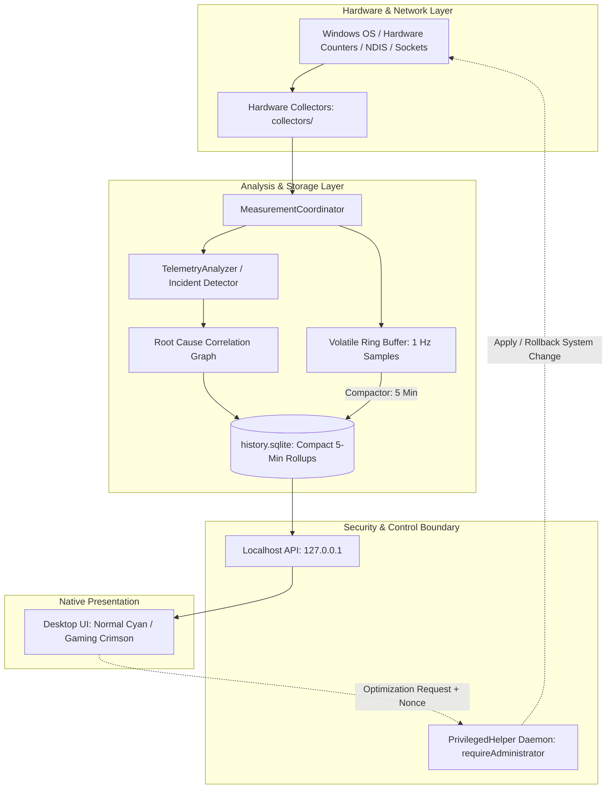

# VEYRA

<div align="center">
  
  <p><strong>Local-First Windows PC Observability, Network Diagnostics, Incident Intelligence, Historical Analysis, Gaming Performance & Evidence-Driven Optimization</strong></p>

  [](https://github.com/SHAZAAN25/Veyra/actions/workflows/ci.yml)
  [-0078D6?logo=windows&logoColor=white)](https://github.com/SHAZAAN25/Veyra)
  [](https://www.python.org/)
  [](tests/)
  [](docs/ARCHITECTURE_SHOWCASE.md)
  [](docs/SECURITY.md)
</div>

---

## 1. Product Overview

**VEYRA** answers the fundamental operational question that fragmented utilities cannot:

> *"What is happening across my PC hardware and network right now, what occurred previously during performance degradation, and what verifiable evidence explains it?"*

Most monitoring software presents isolated, disconnected graphs: Windows Task Manager shows CPU, Discord displays ping, and GPU utilities display temperatures. When lag spikes or frame drops occur, users are left guessing which layer failed.

VEYRA establishes an unbroken, unidirectional evidentiary pipeline:
```
Measurement ──► Observation ──► Assessment ──► Incident ──► Historical Record ──► Explanation ──► Action ──► Verification
```

---

## 2. Why VEYRA Exists

Traditional performance utilities suffer from three critical flaws:
1. **Metric Fragmentation:** Hardware telemetry, network latency, Wi-Fi adapter health, and background processes are monitored in silos without causal correlation.
2. **Reckless Optimization:** "PC Cleaners" and "Game Boosters" demand global Administrator rights to apply opaque registry hacks without baseline measurements, verification, or rollbacks.
3. **Synthetic Guesswork:** Many utilities fabricate smoothed graphs or guess missing data rather than acknowledging physical sensor limitations.

VEYRA solves this by correlating **system state, network latency, Wi-Fi NDIS statistics, incident lifecycles, and configuration changes** into an objective, evidence-based timeline. Every optimization is verified against pre-existing baselines and protected by an **Atomic Rollback Guardian**.

---

## 3. Core Capabilities (Verified Implementation)

All capabilities documented below are fully implemented in the codebase:

### Precision System & Hardware Observability
- **Sub-Second Hardware Telemetry:** Real-time polling (1 Hz) of CPU utilization, core clock frequencies, RAM commit bytes, and disk volume read/write queue depths via native Windows APIs (`psutil`, `kernel32`).
- **GPU Telemetry:** Real-time GPU load, video memory (VRAM) utilization, and engine activity via DXGI and WMI counters.
- **Physical Disk I/O:** Tracks active read/write throughput and storage saturation without polling file contents.

### Network & Wi-Fi Intelligence
- **Active ICMP & Socket Latency:** Multi-target gateway and internet ping monitoring with sub-millisecond precision.
- **Micro-Burst Jitter & Packet Loss:** Detects transient network bufferbloat, gateway packet drops, and upstream DNS resolver timeouts.
- **Wi-Fi NDIS Telemetry:** Real-time link speed, BSSID access point tracking, channel frequency, PHY type, and RSSI signal fluctuation via Windows `netsh wlan`.

### Incident Intelligence & Historical Memory
- **Cross-Layer Root Cause Analysis:** Correlates Wi-Fi signal drops, router queue saturation, DNS lookup delays, and process bandwidth hogs into unified incident records.
- **Incident Replay:** Second-by-second forensic scrubber across recent incidents using high-resolution circular RAM buffers.
- **Personal PC Baseline:** Computes 7-day percentile profiles (P50, P95, P99) of your specific hardware and network behavior.
- **What Changed?:** Differential state engine tracking recently installed services, network adapter configuration updates, and driver modifications.
- **PC Health Flight Recorder:** In-memory rolling buffer (300 samples) preserving pre-incident and pre-spike telemetry windows.

### Safe Optimization & Gaming Intelligence
- **Safe Optimization & PrivilegedHelper:** Elevated modifications (e.g., TCP window auto-tuning, multimedia network throttling) execute strictly through an isolated helper daemon over authenticated loopback IPC with single-use cryptographic nonces.
- **Atomic Rollback Guardian:** Captures HMAC-signed state snapshots before any optimization, enabling single-click, zero-risk restoration.
- **Optimization A/B Testing:** Empirically measures system performance before and after a tweak to verify genuine improvement.
- **Gaming Session DNA:** Generates match stability fingerprints graphing latency variance and thermal throttle events without anti-cheat hooks.
- **Evidence-Grounded AI (Offline):** Deterministic natural language engine ("Explain My PC", "Ask Veyra") citing verified metric timestamps with zero cloud LLM hallucination.

---

## 4. System Architecture

VEYRA follows a unidirectional data flow where presentation layers never own monitoring or storage logic:



For optimization workflows:
```
Measurement ──► Evidence ──► Candidate ──► Snapshot (HMAC) ──► User Approval ──► PrivilegedHelper ──► Apply ──► Verify ──► Auto-Rollback (if degraded)
```

---

## 5. Measurement Integrity Invariant

VEYRA enforces an unyielding architectural law:

> **RULE 1: NEVER FABRICATE A MEASUREMENT.**  
> VEYRA never introduces synthetic telemetry, guessed Wi-Fi values, fake packet loss, or placeholder historical graphs. Every metric is genuine and traceable to real-world Windows performance counters.

If a metric is unavailable due to disconnected hardware or missing OS support, it is explicitly reported as:
- `Unavailable`
- `Not Supported`
- `Measurement Failed`

Simulation data and chaos testing engines are strictly tagged with `is_simulation=True` and isolated from production storage (Rule 9).

---

## 6. Security & Privacy

### Security Model
- **Unprivileged by Default:** The application, GUI, background collectors, and local API execute strictly under standard user privileges (`asInvoker`).
- **Privilege Separation:** Privileged system changes route exclusively through `PrivilegedHelper` over loopback IPC (`127.0.0.1`), validated with single-use cryptographic nonces and caller PID verification.
- **Zero Remote Attack Surface:** Endpoints bind strictly to `127.0.0.1`. No public sockets are opened (`0.0.0.0` is blocked).
- **Subprocess Safety:** All subprocesses use explicit argument lists with `shell=False` to prevent command injection.

### Privacy Invariants (What We NEVER Collect)
- ❌ **Zero Cloud Telemetry:** No user metrics, crash reports, or device fingerprints leave your machine.
- ❌ **No Packet Content Sniffing:** Tracks throughput bytes and latency only; never inspects raw packet payloads or decrypted TLS traffic.
- ❌ **No Browser History:** Never reads browser databases, visited URLs, or session cookies.
- ❌ **No Passwords or Credentials:** System credential vaults and LSASS memory are never touched.
- ❌ **No Personal File Inspection:** Only physical volume read/write throughput is tracked.

*For complete details, see [docs/SECURITY.md](docs/SECURITY.md).*

---

## 7. Installation & Deployment

VEYRA provides two deployment models: **End-User Packaged Release** and **Developer Source Build**.

### Option A: End-User Installation (No Python Required)
The standalone release packages the Python 3.12 embedded runtime, native C-extensions, and UI libraries into a self-contained bundle.

1. **One-Command Headless Install:**
   ```powershell
   powershell -ExecutionPolicy Bypass -File .\install.ps1
   ```
   Installs VEYRA into `%LOCALAPPDATA%\Programs\VEYRA`, adds Start Menu shortcuts, and registers Windows Add/Remove Programs uninstall entries.

2. **One-Command Launch:**
   ```cmd
   run_veyra.bat
   ```

3. **Clean Uninstallation:**
   ```powershell
   powershell -ExecutionPolicy Bypass -File .\uninstall.ps1
   ```
   *Note: User history in `%LOCALAPPDATA%\VEYRA` is preserved by default unless `-PurgeData` is specified.*

### Option B: Developer Setup (Running from Source)
```powershell
# 1. Clone repository
git clone https://github.com/SHAZAAN25/Veyra.git
cd Veyra

# 2. Install dependencies
pip install -r requirements.txt
pip install psutil pillow pyinstaller pytest

# 3. Launch from source
python run.py
```

---

## 8. Automated Testing & Verification

VEYRA is backed by an automated test harness covering unit tests, integration workflows, chaos simulation, and packaging integrity:

```powershell
# Run the complete test suite
python -m pytest tests/ -q
```

**Current Verified Test Results:**
```
============================== 209 passed in 22.50s ==============================
- Test Modules:    41 modules
- Tests Run:       209 passed
- Failures:        0
- Errors:          0
- Skips:           0
```

*Test Coverage Details:*
- **Stages 0–4:** Core contracts, hardware collectors, incident analyzers, storage compactor, and UI.
- **Stage 5:** Localhost API security, gaming intelligence, and diagnostic tests.
- **Stage 6:** `PrivilegedHelper` security, nonce validation, and HMAC snapshot integrity.
- **Stage 7:** Chaos simulation, network bufferbloat injection, fault injection, and soak testing.
- **Stage 8:** Standalone path resolution, production SQLite migration, and installer script validation.

*For complete testing documentation, see [TEST_STRATEGY.md](TEST_STRATEGY.md).*

---

## 9. Repository Structure

```
veyra/
├── app/                  # Application core, contracts, security, UI, supervisor, paths
│   ├── core/             # Path resolution, branding integrity, process supervisor
│   ├── security/         # Token authentication, PrivilegedHelper, nonce validation
│   └── ui/               # Desktop dashboard (Cyan Normal Mode & Crimson Gaming HUD)
├── collectors/           # Real-time hardware & network collectors (psutil, NDIS, sockets)
├── analyzer/             # Telemetry evaluation, baseline profiling, root cause graph
├── storage/              # In-memory circular ring buffer, SQLite WAL compaction engine
├── diagnostics/          # Local diagnostic suites (network, hardware, DNS)
├── optimization/         # Safe optimization opportunities, A/B testing, rollback engine
├── simulation/           # Chaos testing, fault injection, soak harness (Rule 9 isolated)
├── tests/                # 209 automated unit, integration, chaos, and packaging tests
├── installer/            # Packaging specs (veyra.spec, installer.iss, AppxManifest.xml)
├── tools/                # Release manifest & branding manifest generators
├── assets/               # Locked branding assets (Normal Cyan & Gaming Crimson)
├── config/               # Configuration domain schemas and defaults
├── docs/                 # Architectural showcase, security model, case study, portfolio
├── install.ps1           # One-command unprivileged Windows installer
├── uninstall.ps1         # Safe uninstaller (preserves user data by default)
├── run_veyra.bat         # Portable one-command application launcher
├── run.py                # Source entrypoint and foundation verification
├── requirements.txt      # Disciplined runtime dependencies
├── CONTRIBUTING.md          # Contributor guidelines and workflow
└── ARCHITECTURE.md       # Core architecture specification
```

---

## 10. Architecture & Engineering Documentation

| Document | Purpose |
| :--- | :--- |
| **[docs/ARCHITECTURE_SHOWCASE.md](docs/ARCHITECTURE_SHOWCASE.md)** | Comprehensive top-to-bottom systems architecture with Mermaid diagrams. |
| **[docs/SECURITY.md](docs/SECURITY.md)** | Security threat boundaries, `PrivilegedHelper` protocol, and disclosure policy. |
| **[docs/PORTFOLIO.md](docs/PORTFOLIO.md)** | Senior engineering portfolio overview and technical challenge breakdowns. |
| **[docs/RESUME_PROJECT.md](docs/RESUME_PROJECT.md)** | Recruiter-friendly summary, high-impact bullet points, and stack metrics. |
| **[docs/CASE_STUDY.md](docs/CASE_STUDY.md)** | Technical case study analyzing design trade-offs and empirical results. |
| **[docs/RELEASE.md](docs/RELEASE.md)** | Release engineering, versioning, build pipeline, and QA checklists. |
| **[PROJECT_RULES.md](PROJECT_RULES.md)** | Non-negotiable engineering invariants (Rule 1: Truthfulness; Rule 9: Simulation Isolation). |
| **[TEST_STRATEGY.md](TEST_STRATEGY.md)** | Automated test taxonomy, chaos simulation, and soak test architecture. |
| **[CONTRIBUTING.md](CONTRIBUTING.md)** | Contributor guidelines, development setup, and code review standards. |

---

## 11. Project Roadmap

- **Stage 0–4:** Core Contracts, Real Collectors, Analyzer, SQLite Storage, Desktop UI — **[COMPLETE]**
- **Stage 5:** Diagnostics, Gaming Intelligence, Safe Optimization, Deterministic AI — **[COMPLETE]**
- **Stage 6:** Security, Privacy, Privilege Separation & Reliability Hardening — **[COMPLETE & VERIFIED]**
- **Stage 7:** Automated Testing, Chaos Simulation, Fault Injection & QA Harnesses — **[COMPLETE & VERIFIED]**
- **Stage 8:** Packaging, MSIX / Inno Setup Installer, One-Command Deployment & QA — **[COMPLETE & VERIFIED]**
- **Stage 9:** GitHub Integration, Documentation & Portfolio Polish — **[CURRENT]**
- **Stage 10:** Final Production Audit & Certification — **[PLANNED / UPCOMING]**

---

## 12. Known Limitations

- **Platform Focus:** Built specifically for Windows 10/11 (64-bit). Linux, macOS, and Windows ARM64 are not supported in this release.
- **Code Signing:** Open-source release builds use self-signed / ad-hoc Authenticode certificates; Windows SmartScreen warnings may appear during setup until an Extended Validation (EV) certificate is applied.
- **Hardware-Specific Counters:** Detailed GPU engine utilization requires compatible DirectX 12 / WMI driver interfaces; integrated legacy graphics may report limited telemetry.

---

## 13. License

License: Not yet specified.
