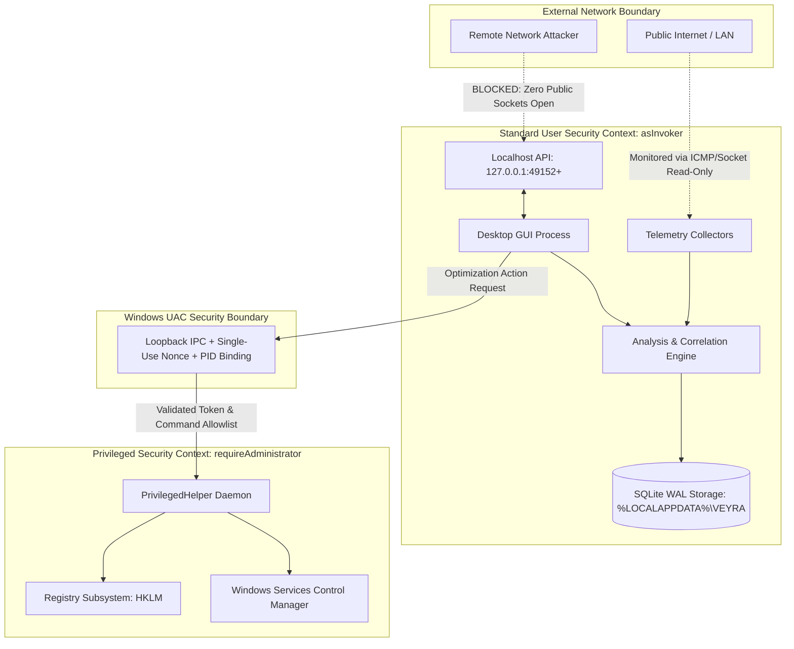

# VEYRA — Security Model & Vulnerability Management

> **Document Class:** Security Model, Threat Boundary Specification & Disclosure Policy  
> **Audience:** Application Security Reviewers, Enterprise Administrators, Contributors  
> **Target Platform:** Microsoft Windows 10/11 (x64)  
> **Authoritative Repository:** [github.com/SHAZAAN25/Veyra](https://github.com/SHAZAAN25/Veyra)

---

## 1. Security Philosophy & Invariants

VEYRA is built from the ground up on the **Principle of Least Privilege**, **Local-First Privacy**, and **Measurement Truthfulness**. System monitoring and PC optimization software has historically suffered from dangerous anti-patterns: running full desktop applications as `NT AUTHORITY\SYSTEM` or Administrator, injecting unverified DLLs into games, sending private network telemetry to cloud analytics, and executing arbitrary PowerShell scripts to "boost" PC performance.

VEYRA categorically eliminates these hazards by adhering to five security invariants:

1. **Unprivileged by Default:** The main application, UI, background collectors, and HTTP/WebSocket APIs execute entirely under standard, non-elevated user credentials.
2. **Strict Privilege Isolation:** Privileged actions (e.g., specific registry or network adapter parameter updates) are isolated behind a dedicated, authenticated IPC helper (`PrivilegedHelper`).
3. **Zero Remote Attack Surface:** All network sockets bind strictly to the loopback interface (`127.0.0.1`). Public interfaces (`0.0.0.0`) are never bound.
4. **Zero Cloud Telemetry:** No user metrics, hardware signatures, process lists, or network packet data are transmitted off the local machine. Core functionality operates 100% offline.
5. **Deterministic Reversibility:** No system modification may be executed without first creating an atomic rollback snapshot.

---

## 2. Threat Boundaries & Architecture



### Threat Boundary Analysis:

| Boundary | Threat Vector | Mitigation Strategy |
| :--- | :--- | :--- |
| **Network Interface** | Remote exploitation via exposed port | Sockets bind exclusively to `127.0.0.1`. The application requests zero Windows Defender Firewall inbound rules. |
| **API Consumer** | Local unprivileged process tampering | API endpoints require bearer token authentication. Tokens are generated ephemerally per session with high-entropy randomness (`secrets.token_hex(32)`). |
| **Optimization Execution** | Arbitrary privilege escalation | `PrivilegedHelper` enforces an exact command allowlist. Shell interpretation is disabled (`shell=False`). Arguments are strictly validated against pre-compiled regex schemas. |
| **Storage / Rollback** | Tampering with rollback snapshots | Optimization state snapshots are signed using HMAC-SHA256 with an ephemeral key. Modified snapshots fail signature checks and cannot be executed. |
| **Testing / Simulation** | Synthetic data contaminating production | **Rule 9 Enforcement:** Simulation engines enforce `is_simulation=True`. Packaging scripts explicitly strip `simulation/` and `tests/` directories from release binaries. |

---

## 3. Privilege Separation (`PrivilegedHelper`)

When a user approves an optimization that requires system-level modification (such as adjusting TCP window auto-tuning or network throttling indexes):

1. **No Global Elevation:** The main `VEYRA.exe` process **never** elevates itself.
2. **Ephemeral Token & Nonce Generation:** An ephemeral, cryptographically secure 256-bit token and a single-use monotonic nonce are generated in standard user space.
3. **PID Binding:** The authorization request includes the caller's verified Process ID (PID). The helper inspects the caller process identity before accepting any payload.
4. **Strict Allowlist:** The helper checks the requested action against an immutable dictionary of pre-approved commands:
   ```python
   ALLOWED_ACTIONS = {
       "disable_network_throttling": {
           "reg_key": r"SOFTWARE\Microsoft\Windows NT\CurrentVersion\Multimedia\SystemProfile",
           "val_name": "NetworkThrottlingIndex",
           "val_type": "REG_DWORD",
           "val_data": 0xFFFFFFFF,
           "requires_elevation": True
       },
       "set_tcp_autotuning": {
           "cmd": ["netsh", "interface", "tcp", "set", "global", "autotuninglevel=normal"],
           "requires_elevation": True
       }
   }
   ```
5. **No Shell Execution:** Subprocesses are invoked strictly with a list of arguments and `shell=False`. Arbitrary string interpolation or command chaining (`&`, `|`, `;`) is architecturally blocked.

---

## 4. Subprocess & Path Traversal Security

- **Path Normalization:** All user-supplied and environment-derived file paths are resolved using `pathlib.Path.resolve()` and validated against a root containment check to prevent directory traversal (`../`) attacks.
- **Safe Directory Separation:**
  - **Program Binaries (Immutable):** Installed to `%LOCALAPPDATA%\Programs\VEYRA` with standard read/execute permissions.
  - **User Data (Mutable):** Stored in `%LOCALAPPDATA%\VEYRA` under dedicated subdirectories (`data/`, `logs/`, `config/`, `exports/`).

---

## 5. Privacy & Data Collection Audit

VEYRA is strictly **read-only and non-intrusive** regarding user privacy. 

### Data We NEVER Collect:
- ❌ **No Packet Content Sniffing:** Telemetry tracks throughput bytes, latency, and socket counts. Raw network packet payloads (HTTP headers, payload bodies, decrypted TLS traffic) are never captured or stored.
- ❌ **No Browser History:** VEYRA never inspects browser databases, visited URLs, search queries, or session cookies.
- ❌ **No Passwords or Credentials:** System credential stores, LSASS, and memory heaps are never accessed.
- ❌ **No Personal File Inspection:** Disk observability monitors physical volume statistics (read/write bytes per second, queue depth). File names, user document directories, and file contents are never read.
- ❌ **No Cloud Telemetry or Analytics:** VEYRA does not use Google Analytics, Sentry, Mixpanel, Segment, or any remote telemetry collector. Zero data leaves the host.

---

## 6. Storage Integrity & Bounded Logging

- **SQLite WAL Mode:** SQLite databases operate with Write-Ahead Logging (`PRAGMA journal_mode=WAL`), guaranteeing atomic transactions and preventing corruption in the event of unexpected power loss.
- **HMAC Snapshot Verification:** All rollback snapshots stored in `%LOCALAPPDATA%\VEYRA\data\` contain SHA-256 HMAC signatures verifying that pre-optimization system state has not been tampered with before a rollback is applied.
- **Sanitized, Rotating Logs:** Application logging is strictly bounded (`maxBytes=10485760`, `backupCount=3`). Loggers automatically redact authorization tokens, PII, and raw command strings containing sensitive system parameters.

---

## 7. Known Security Limitations

- **Ad-Hoc Signing:** Current open-source release binaries use self-generated Authenticode signatures. Enterprise automated deployment will prompt Windows SmartScreen until an Extended Validation (EV) certificate is procured.
- **Local Multi-User Environments:** If multiple unprivileged users share a single Windows machine, each user maintains isolated `%LOCALAPPDATA%\VEYRA` configurations. However, system-wide optimization changes (such as global TCP auto-tuning) affect all users on the host OS.

---

## 8. Responsible Vulnerability Disclosure Policy

If you identify a security vulnerability in VEYRA:

1. **DO NOT disclose the vulnerability publicly** in GitHub issues, forums, or social media.
2. Email full technical details and proof-of-concept steps directly to the project maintainer:
   - **Primary Contact:** [shazaan25@users.noreply.github.com](mailto:shazaan25@users.noreply.github.com)
   - **Subject Line:** `[SECURITY] VEYRA Vulnerability Report - <Brief Description>`
3. **Response SLA:** The maintainer will acknowledge receipt within 48 hours and provide an initial assessment and patch timeline within 7 business days.
4. **Coordinated Disclosure:** We kindly request that you maintain confidentiality until a verified security patch has been released.
