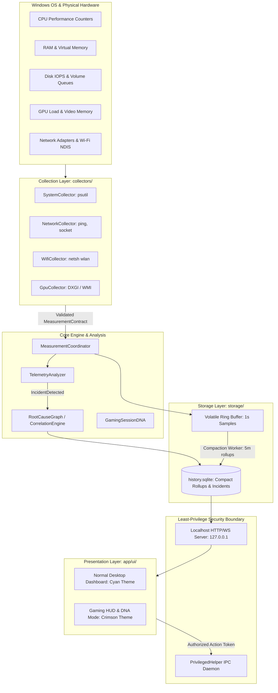
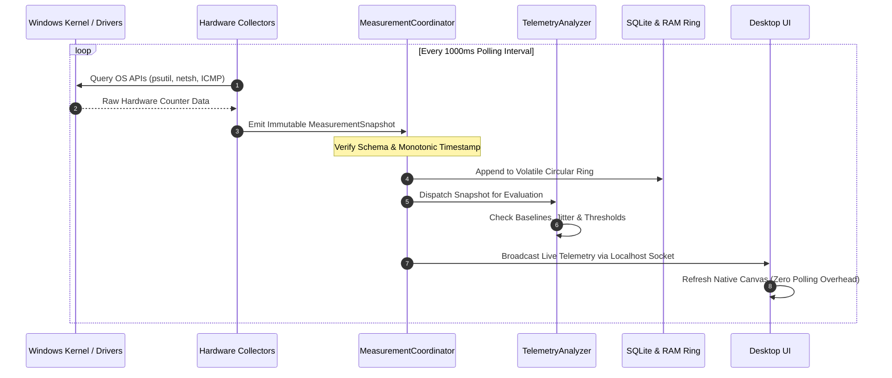
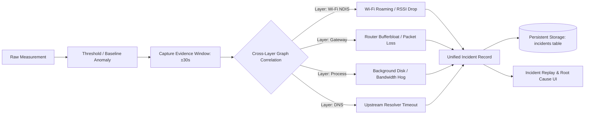
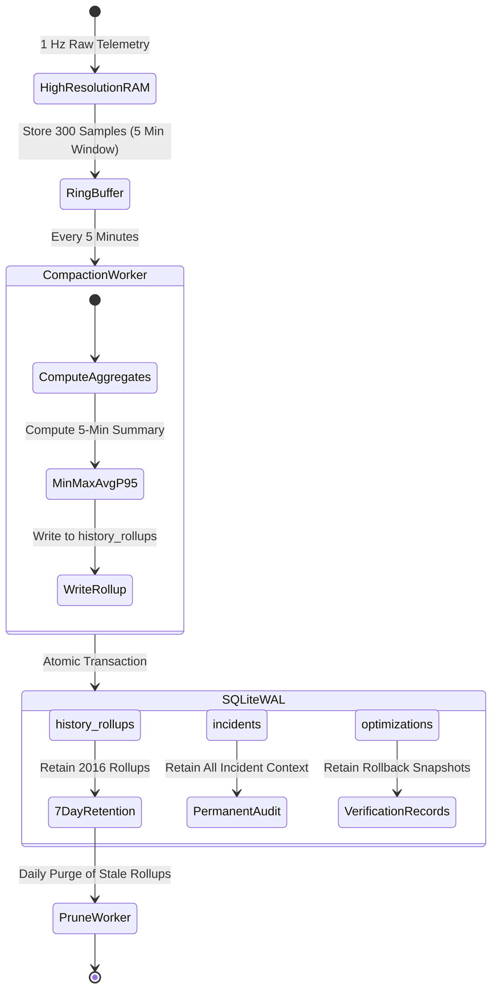
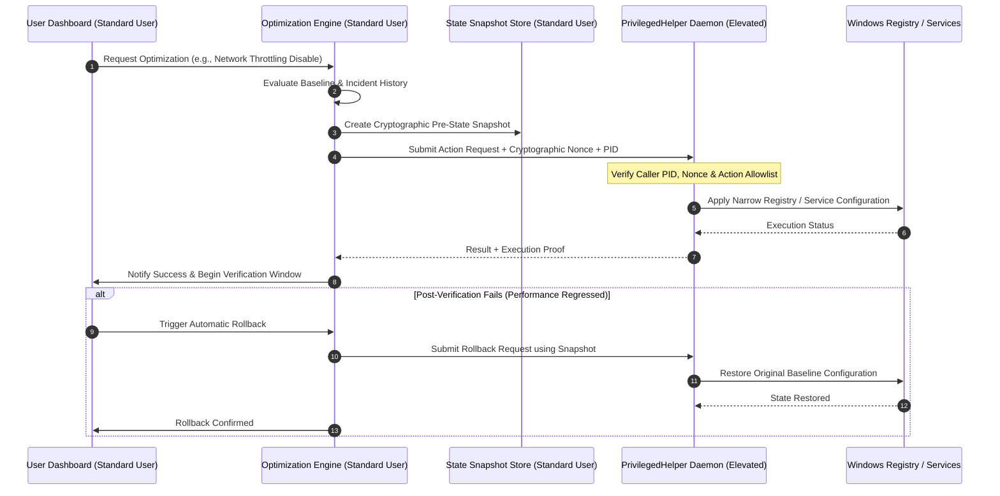
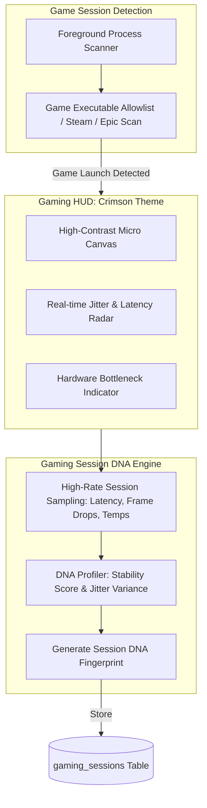
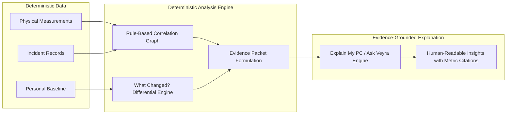
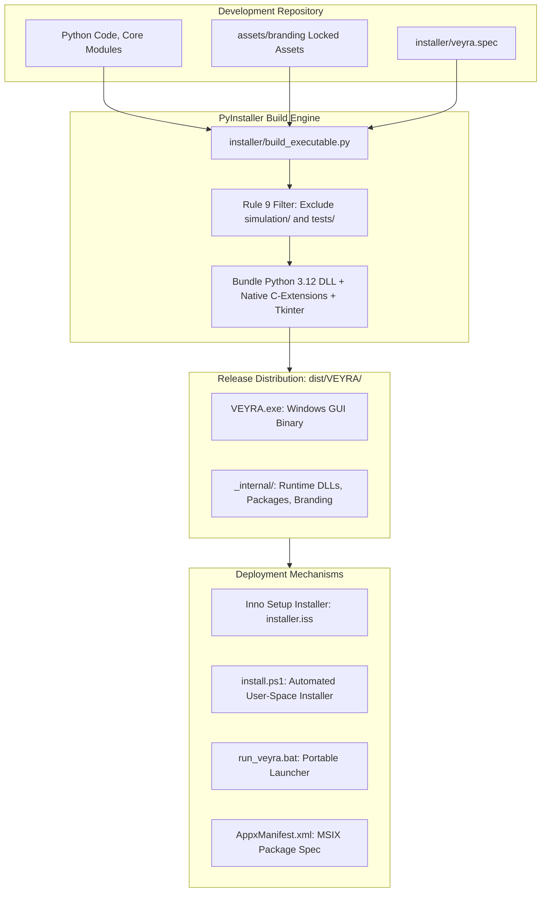

# VEYRA — Architectural Deep Dive & Systems Showcase

> **Document Class:** Technical Architecture Specification & Systems Showcase  
> **Audience:** Senior Systems Architects, Observability Engineers, Security Reviewers  
> **Target Platform:** Microsoft Windows 10/11 (x64)  
> **Canonical Repository:** [github.com/SHAZAAN25/Veyra](https://github.com/SHAZAAN25/Veyra)

---

## 1. Executive Architecture Overview

VEYRA is a **local-first Windows desktop PC observability, network diagnostics, incident intelligence, and evidence-driven optimization engine**. It is engineered to solve a systemic problem in contemporary PC management tools: metric fragmentation, synthetic guesswork, ungrounded recommendations, and unconstrained privilege escalation.

Rather than presenting disjointed real-time meters, VEYRA correlates physical hardware performance, network protocol latency, network adapter states, background processes, historical baselines, and system changes into a single deterministic evidence graph.

---

## 2. Unidirectional Measurement Pipeline

At the foundation of VEYRA is a strict engineering invariant: **Rule 1 — Never Fabricate a Measurement**. If telemetry is missing, hardware is unsupported, or an adapter is disconnected, the system explicitly reports `Unavailable` or `Not Supported`. Guesses, synthetic smoothing, and placeholder interpolation are categorically rejected.

### Telemetry Pipeline Invariants:
1. **Immutable Snapshots:** All readings are frozen into `MeasurementSnapshot` dataclasses immediately upon collection.
2. **Zero In-Memory Drift:** Monotonic clocks (`time.monotonic()`) are used exclusively for interval coordination; wall clocks (`datetime.now(timezone.utc)`) are used strictly for human-readable audit timestamps.
3. **Graceful Degeneration:** A failure in an optional sensor (such as discrete GPU video memory query) never halts core CPU or network throughput telemetry.

---

## 3. Incident Intelligence Pipeline

Traditional monitoring tools inform users *that* a metric spiked; VEYRA determines *why* it spiked and traces the causal path across physical and logical boundaries.

### Cross-Layer Root Cause Architecture
When network latency elevates or system throughput degrades, VEYRA correlates:
- **Physical Wi-Fi Signal:** RSSI, BSSID transition, channel contention.
- **Local Network Gateway:** Default route ping latency, ARP table churn.
- **DNS Subsystem:** UDP query duration, fallback nameserver latency.
- **Process Activity:** Top process CPU, working set memory, disk I/O delta, active sockets.

An incident is recorded with its full context (the pre-incident baseline, the trigger sample, and the post-incident recovery), allowing **Incident Replay** to reproduce exact conditions second-by-second.

---

## 4. Historical Storage & Compaction Lifecycle

VEYRA operates without external database servers or cloud telemetry aggregators. Persistent storage is managed via a zero-maintenance local SQLite engine configured for deterministic retention.

### Storage Characteristics:
- **Zero Thrashing:** High-frequency 1-second telemetry is maintained exclusively in a pre-allocated RAM circular buffer. Only compacted 5-minute statistical summaries (Min, Max, Avg, P95) are committed to disk.
- **Write-Ahead Logging (WAL):** SQLite operates with `PRAGMA journal_mode=WAL` and `PRAGMA synchronous=NORMAL`, preventing database locks during simultaneous UI reads and collector writes.
- **Tamper-Evident Signatures:** Incident and optimization records incorporate HMAC cryptographic signatures to verify state consistency across application restarts.

---

## 5. Safe Optimization & Least-Privilege Security Boundary

VEYRA adheres strictly to the **Principle of Least Privilege**. The main user application, native desktop dashboard, local API, and telemetry analyzers execute as standard, unprivileged user-mode processes.

### Security Boundary Guarantees:
1. **No Blanket Administrator Shell:** The application executable `VEYRA.exe` never requests administrator rights in its manifest (`requestedExecutionLevel="asInvoker"`).
2. **Authenticated Loopback IPC:** Privileged actions are delegated exclusively to a narrowly scoped `PrivilegedHelper` over loopback socket (`127.0.0.1`), requiring single-use cryptographic tokens.
3. **Strict Action Allowlisting:** The helper only executes explicitly enumerated system configuration commands with strict argument allowlists; arbitrary shell execution (`cmd.exe`, PowerShell arbitrary string execution) is impossible.
4. **Mandatory Rollback Guardian:** Every optimization automatically captures the existing system state in an atomic snapshot before modification, allowing instantaneous, one-click restoration.

---

## 6. Gaming Intelligence & Session DNA Architecture

Gaming mode provides telemetry for esports and high-performance gaming without injecting hook DLLs into game processes.

### Gaming Invariants:
- **Zero Anti-Cheat Interference:** VEYRA never uses Windows API hooking (`SetWindowsHookEx`), DLL injection, or kernel memory inspection. Anti-cheat engines (Riot Vanguard, Easy Anti-Cheat, BattlEye) remain unaffected.
- **Session DNA Fingerprint:** Captures stability variance, packet jitter distributions, and GPU/CPU thermal throttling events over the duration of the match to produce an objective session health rating.

---

## 7. Evidence-Grounded AI Boundary

VEYRA contains zero external cloud LLM dependencies, requires zero third-party API keys, and transmits zero user telemetry off the machine.

- **Rule 10 Adherence:** The reasoning engine operates on verified facts. It answers questions like *"Why was my ping spiking at 8:15 PM?"* by querying actual stored packet loss, BSSID transitions, and process network I/O from that exact timestamp.
- **Zero Hallucination:** Explanations cite verified telemetry timestamps and metric values. If no evidence exists for a causal link, the engine explicitly reports inconclusive data rather than inventing a narrative.

---

## 8. Standalone Production Packaging Architecture

VEYRA packages into an independent Windows desktop application distribution requiring zero host development prerequisites.

### Packaging Highlights:
- **Clean User Separation:** Application binaries install to `%LOCALAPPDATA%\Programs\VEYRA`, while dynamic SQLite records and logs reside in `%LOCALAPPDATA%\VEYRA`.
- **Zero Cloud or Developer Dependencies:** The built executable operates entirely offline on fresh Windows installations without Python, Git, or VS Code.
- **Rule 9 Enforcement:** All chaos engines, simulation fixtures, and synthetic injectors are excluded at packaging time, guaranteeing production distributions ship with zero synthetic data.
