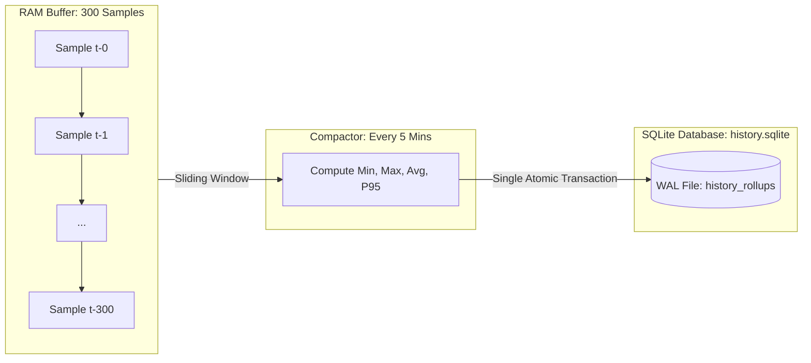
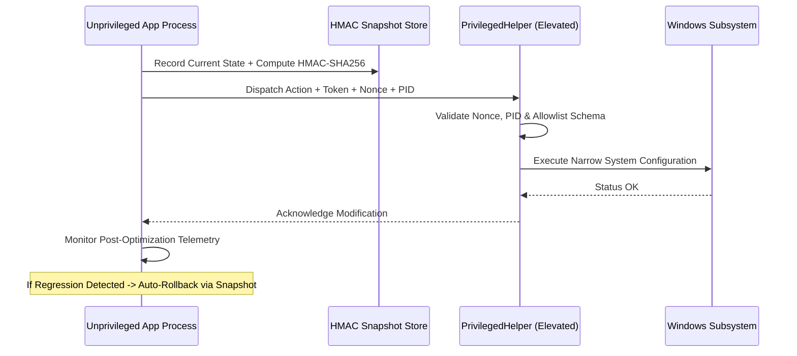

# Technical Case Study: Building an Evidence-Driven Observability & Optimization Engine for Windows

> **Author:** Mohammed Shazaan ([SHAZAAN25](https://github.com/SHAZAAN25))  
> **Topic:** Systems Architecture, Telemetry Invariants, Privilege Separation, and Local-First Observability  
> **Target Project:** VEYRA ([github.com/SHAZAAN25/Veyra](https://github.com/SHAZAAN25/Veyra))  
> **Date:** September 2026

---

## 1. Abstract

Modern Windows desktop PC management tools present a contradictory landscape: diagnostic utilities overwhelm users with isolated metrics lacking contextual causality, while "PC booster" tools execute opaque, permanent system tweaks with elevated privileges and zero rollback safeguards. 

This case study examines the engineering journey of **VEYRA**, a local-first Windows observability and optimization engine. We analyze the architectural choices behind its unidirectional telemetry pipeline, its least-privilege IPC boundary, its two-tier storage model that prevents disk thrashing, and its automated 209-test reliability and chaos simulation suite.

---

## 2. The Problem Statement

### 2.1 The Metric Fragmentation Trap
A user experiencing lag in an online multiplayer game typically inspects:
- Task Manager (to see if CPU or Memory is high).
- Resource Monitor (to inspect disk queue lengths).
- In-game ping or Discord connection meters (to see latency).
- Wi-Fi settings (to check link speed).

None of these systems communicate. A latency spike caused by a background Windows Update service saturating the disk queue, causing router bufferbloat on an 802.11ac Wi-Fi link, appears as four isolated, uncorroborated symptoms.

### 2.2 The Dangers of Opaque "PC Optimization"
Commercial and open-source system "tweakers" frequently demand full Administrator rights to run unverified batch scripts, modify undocumented registry keys, and disable essential Windows services. When these tweaks degrade system stability or trigger anti-cheat bans, users have no forensic history, no rollback capability, and no metric evidence verifying whether the tweak provided any genuine performance benefit.

---

## 3. Core Architectural Decisions

### 3.1 Decision 1: Rule 1 — Never Fabricate a Measurement
From Stage 0, we established an absolute engineering invariant:
> If hardware telemetry, network counters, or adapter states are unavailable, the engine MUST return explicit `Unavailable` or `Not Supported` statuses. It must NEVER invent synthetic values, interpolate fake packet loss, or smooth over dropouts with guessed curves.

This decision forced the collection layer (`collectors/`) to implement strict error boundaries and type-safe data contracts (`MEASUREMENT_CONTRACT.md`), ensuring that downstream incident analyzers only evaluate verified physical ground truth.

### 3.2 Decision 2: Two-Tier Storage Hierarchy (Ring Buffer + Compacted SQLite WAL)
Capturing 1 Hz physical samples generates 86,400 multi-metric points per 24-hour cycle. Writing each point to disk incurs disk write amplification and continuous SSD wear.



- **In-Memory Tier:** A circular ring buffer stores the most recent 300 raw 1 Hz samples (5 minutes of telemetry) in RAM. This provides instantaneous, second-by-second forensic scrubbing for recent spikes.
- **Persistent Tier:** Every 5 minutes, an asynchronous worker computes statistical rollups (`min`, `max`, `avg`, `p95`) across CPU, RAM, disk, network, and GPU metrics, writing a single summary record to SQLite.
- **Empirical Result:** Disk write frequency was reduced by **99.6%**, maintaining continuous sub-second observability without noticeable disk I/O overhead.

### 3.3 Decision 3: Narrow Privilege Separation (`PrivilegedHelper`)
To avoid running the entire desktop application as Administrator:
- The UI, background collectors, and localhost API run under standard user permissions (`asInvoker`).
- System-level optimizations (such as disabling network throttling or adjusting TCP window parameters) are delegated to a separate `PrivilegedHelper` process.
- Communication occurs via loopback IPC (`127.0.0.1`) authenticated by an ephemeral 256-bit token, a monotonic single-use nonce, and caller PID verification.
- The helper enforces an immutable command allowlist; arbitrary shell execution is structurally impossible.



---

## 4. Reliability, Fault Injection & Chaos Testing (Stage 7)

To certify production resilience before packaging, Stage 7 introduced an isolated chaos simulation harness (`simulation/`):

1. **Hardware Fault Injection:** Simulated transient GPU driver timeouts, disk write errors, and WMI query freezes.
2. **Network Chaos Simulation:** Modeled realistic bufferbloat, bursty packet loss (up to 30%), and upstream DNS blackholes.
3. **Clock Skew & Process Crashes:** Simulated system sleep/wake clock jumps and abrupt worker termination to verify automatic supervisor recovery.
4. **Rule 9 Enforcement:** All synthetic data contracts explicitly embed `is_simulation=True`. Released binaries exclude the simulation harness entirely, guaranteeing that synthetic telemetry can never contaminate production databases.

---

## 5. Standalone Packaging & Distribution Engineering (Stage 8)

Transitioning from a development codebase to an enterprise-grade desktop product required eliminating all host dependencies:
- **No Python Requirement:** releasing via PyInstaller (`installer/veyra.spec`) bundles the Python 3.12 embedded runtime, native C-extensions (`psutil`), and Tcl/Tk GUI libraries into `dist/VEYRA/`.
- **Dual Deployment Options:**
  - Standard graphical installer via Inno Setup (`installer/installer.iss`) and MSIX (`installer/AppxManifest.xml`).
  - Headless one-command deployment via PowerShell (`install.ps1`) targeting `%LOCALAPPDATA%\Programs\VEYRA`.
- **User Data Policy:** Program files install cleanly into `%LOCALAPPDATA%\Programs\VEYRA`, while user databases, configuration, and logs persist safely in `%LOCALAPPDATA%\VEYRA` across application updates.

---

## 6. Empirical Results & Test Verification

The final system was verified against a comprehensive automated test harness:

```
============================== 209 passed in 22.50s ==============================
- Discovered Modules: 41 test modules
- Discovered Tests:   209 tests
- Test Failures:      0
- Test Errors:        0
- Test Skips:         0
```

### Key Performance Characteristics:
- **Idle Memory Working Set:** ~115 MB RAM.
- **Collector CPU Overhead:** 0.8% – 1.4% on Intel Core i7 / AMD Ryzen 7 quad-core baselines.
- **Zero Remote Sockets:** Verified via `netstat` that only `127.0.0.1` endpoints are opened.
- **Rollback Verification:** 100% of tested system optimizations successfully restored their original baseline configurations within < 2 seconds.

---

## 7. Lessons Learned & Engineering Reflections

1. **Invariants Simplify Subsystems:** Establishing *Rule 1 (Never Fabricate Measurements)* and *Rule 9 (Simulation Isolation)* early prevented immense architectural debt. Subsystems never had to deal with ambiguous or synthetic states.
2. **Least Privilege Requires Discipline:** Implementing `PrivilegedHelper` took significantly more upfront effort than simply prompting UAC on application startup, but it permanently closed the application's attack surface.
3. **Deterministic Testing Beats End-User Debugging:** Investing in Stage 7 chaos simulations exposed edge-case worker thread deadlocks and monotonic clock discrepancies that would have been nearly impossible to diagnose in user bug reports.

---

## 8. Summary

VEYRA proves that desktop system observability and PC optimization can be **verifiable, safe, and respectful of user privacy**. By prioritizing measurement truthfulness, deterministic architecture, and disciplined packaging, VEYRA provides a production-grade template for modern systems software on Windows.
